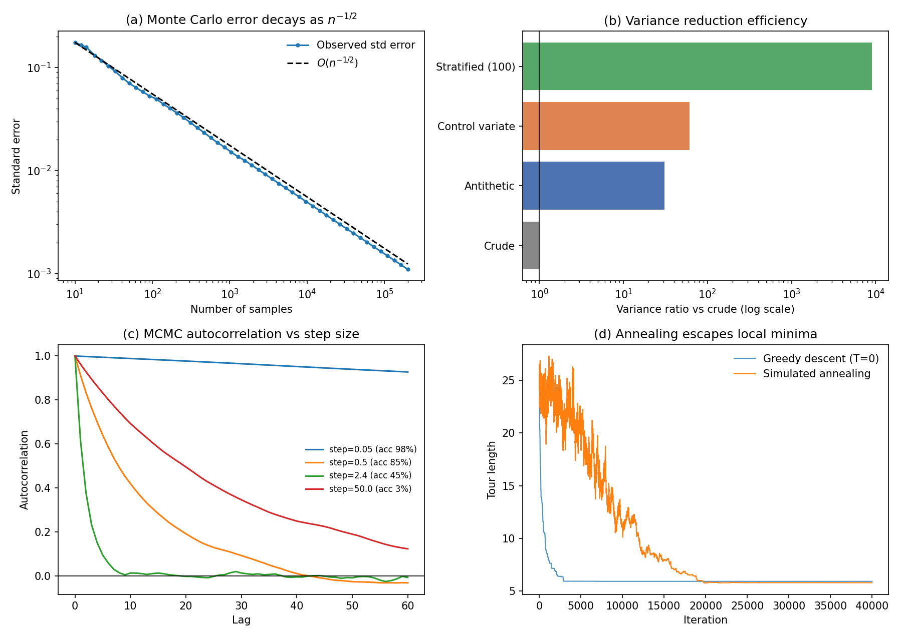
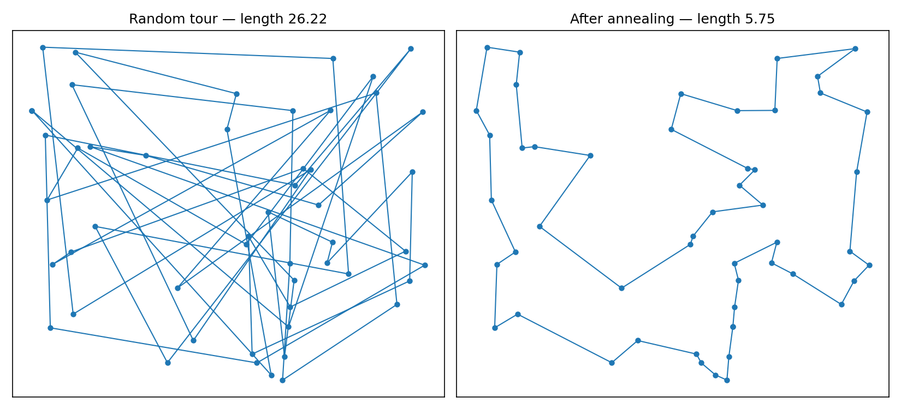

# Monte Carlo & Stochastic Methods

Une implémentation propre et testée des méthodes de Monte Carlo et de leurs
diagnostics : réduction de variance, échantillonnage préférentiel, MCMC
(Metropolis-Hastings, Gibbs), recuit simulé.

Le fil directeur : **une estimation Monte Carlo sans mesure de son incertitude
n'est pas un résultat**. Chaque estimateur ici renvoie sa barre d'erreur, et
chaque diagnostic est testé sur le cas qu'il est censé détecter.

## 1. Réduction de variance

Intégrale de exp(x) sur [0,1], n = 100 000 tirages pour chaque méthode :

| Méthode | Estimation | Erreur std | Gain en variance | Écart à la vérité |
|---|---|---|---|---|
| Crude | 1,719249 | 1,55·10⁻³ | 1,0× | 9,7·10⁻⁴ |
| Antithétique | 1,718254 | 2,79·10⁻⁴ | 31× | 2,8·10⁻⁵ |
| Variable de contrôle | 1,718192 | 1,99·10⁻⁴ | 61× | 8,9·10⁻⁵ |
| **Stratifié (100 strates)** | 1,718291 | **1,63·10⁻⁵** | **9 080×** | 9,5·10⁻⁶ |

Vérité : e − 1 = 1,718282.

Les quatre estimateurs sont sans biais et s'accordent dans leurs barres
d'erreur — ils ne diffèrent que par la variance.

### Les variables antithétiques ne sont pas inconditionnellement sûres

| Intégrande | Gain en variance | Verdict |
|---|---|---|
| exp(x) — monotone | 31,0× | aide |
| (x−0,5)² — symétrique | 0,50× | **nuit** |

La technique repose sur la corrélation négative entre f(U) et f(1−U). Pour un
intégrande symétrique autour du milieu, cette corrélation devient positive et
la variance **double**. C'est la seule technique de ce repo qui peut dégrader
le résultat ; la stratification proportionnelle, elle, ne peut jamais nuire.

## 2. Échantillonnage préférentiel — événement rare

Estimation de P(X > 4) pour X ~ N(0,1), avec une proposition N(4,1) :

| | Estimation | Erreur std | Erreur relative |
|---|---|---|---|
| Vérité | 3,167124·10⁻⁵ | — | — |
| Crude MC | 3,00·10⁻⁵ | 1,73·10⁻⁵ | **58 %** |
| Importance sampling | 3,175·10⁻⁵ | 2,13·10⁻⁷ | **0,67 %** |

**Gain en variance : 6 585×.**

### La subtilité qui rend ce cas intéressant

Les deux diagnostics d'ESS donnent des verdicts opposés sur ce même run :

| Diagnostic | Valeur | Lecture |
|---|---|---|
| ESS(poids) | **0,0158 %** | catastrophique |
| ESS(poids × intégrande) | **18,12 %** | sain |

Le second a raison. L'ESS classique mesure la dispersion des poids *partout*,
y compris dans l'immense région où l'indicateur vaut zéro et où les poids
n'ont donc aucune influence sur l'estimateur. Ce qui contrôle réellement
l'erreur, c'est la dispersion du produit w·h.

Conclusion pratique : sur un problème d'événement rare, juger un run
d'importance sampling sur l'ESS des poids seuls conduit à rejeter un
estimateur 6 500 fois plus efficace que le crude. Les deux sont reportés.

## 3. MCMC — le pas de proposition et l'ESS

Metropolis-Hastings à marche aléatoire sur une N(0,1), 20 000 tirages
après burn-in :

| Pas | Taux d'acceptation | ESS | ESS/n | SE naïve | SE vraie |
|---|---|---|---|---|---|
| 0,05 | 98,3 % | 56 | 0,3 % | 7,54·10⁻³ | **1,42·10⁻¹** |
| 0,50 | 84,6 % | 879 | 4,4 % | 6,97·10⁻³ | 3,33·10⁻² |
| **2,40** | **45,1 %** | **4 650** | **23,3 %** | 7,05·10⁻³ | **1,46·10⁻²** |
| 10,0 | 12,9 % | 1 638 | 8,2 % | 7,25·10⁻³ | 2,53·10⁻² |
| 50,0 | 2,6 % | 325 | 1,6 % | 7,25·10⁻³ | 5,69·10⁻² |

Deux lectures :

**L'optimum empirique tombe à 45,1 % d'acceptation**, ce qui reproduit le
taux théorique d'environ 44 % en dimension 1 (Roberts, Gelman & Gilks). Un
taux d'acceptation élevé n'est pas un bon signe : à pas = 0,05 la chaîne
accepte 98 % des propositions tout en n'allant nulle part.

**La colonne "SE naïve" est presque constante** — elle ne voit rien du
problème. Sur la chaîne la plus collante, elle sous-estime l'erreur réelle
d'un **facteur 19**. C'est la raison d'être de l'ESS : `s/sqrt(n)` est
simplement faux sur une chaîne autocorrélée.

### Gibbs : le coût caché de l'acceptation à 100 %

Le Gibbs accepte toutes ses propositions par construction. Le coût se paie
ailleurs :

| Corrélation cible ρ | ESS/n |
|---|---|
| 0,00 | 96,10 % |
| 0,50 | 56,94 % |
| 0,90 | 10,53 % |
| 0,99 | **1,07 %** |

Quand ρ → 1, les lois conditionnelles se resserrent, la chaîne progresse par
petits pas alignés sur les axes et le mélange s'effondre — invisible sur le
taux d'acceptation, qui reste à 100 %.

### Gelman-Rubin

| Configuration | R̂ |
|---|---|
| Chaînes bien réglées, départs dispersés | 1,0001 |
| Chaînes collantes, départs éloignés | 15,50 |

R̂ proche de 1 est nécessaire mais jamais suffisant : des chaînes bloquées
dans le même mode d'une cible multimodale s'accordent parfaitement entre
elles et donnent R̂ = 1 en manquant l'essentiel de la distribution.

## 4. Recuit simulé — voyageur de commerce (50 villes)

| | Longueur du tour |
|---|---|
| Tour initial aléatoire | 26,216 |
| Descente gloutonne (T = 0) | 5,899 |
| **Recuit simulé** | **5,749** |

Le recuit fait 2,5 % mieux que la descente gloutonne, à budget d'itérations
identique et depuis le même point de départ. La différence tient entièrement
au fait que le recuit accepte des mouvements dégradants au début (15,3 %
d'acceptation contre 0,6 %) : accepter de mauvais coups n'est pas un défaut
à corriger, c'est le seul mécanisme qui permet de sortir d'un minimum local.





## Deux bugs trouvés en écrivant les tests

Ils sont mentionnés ici parce qu'ils sont plus instructifs que le code qui
marche du premier coup.

**1. La variance de l'estimateur stratifié était calculée comme si les
tirages étaient i.i.d.** La formule `s/sqrt(n)` sur l'échantillon groupé
renvoyait 1,56·10⁻³ — c'est-à-dire exactement l'erreur du crude — alors que
la vraie erreur est 1,63·10⁻⁵, soit 95 fois moins. La stratification est
précisément ce qui rend l'échantillon non-i.i.d. ; la variance doit se
calculer strate par strate :

    Var = Σ_h w_h² · s_h² / n_h

Le bug ne faisait pas planter le code et ne biaisait pas l'estimation : il
masquait simplement tout le gain. Verrouillé par
`test_stratified_variance_is_computed_per_stratum`.

**2. La stabilisation des poids cassait l'estimateur non auto-normalisé.**
Soustraire `log_w.max()` avant l'exponentielle est indispensable pour éviter
le sous-débordement, et sans effet sur l'estimateur auto-normalisé où la
constante se simplifie. Mais sur l'estimateur simple — le seul non biaisé
quand les deux densités sont normalisées — ce décalage multiplie le résultat
par exp(−max log w). Les deux chemins sont maintenant séparés explicitement.

## Contenu

| Module | Rôle |
|---|---|
| `src/estimators.py` | Estimateur MC avec IC, chemin de convergence, dimensionnement d'échantillon |
| `src/variance_reduction.py` | Antithétique, variable de contrôle, stratification, importance sampling |
| `src/mcmc.py` | Metropolis-Hastings, Gibbs, autocorrélation, ESS, Gelman-Rubin |
| `src/annealing.py` | Recuit simulé générique + instance TSP avec voisinage 2-opt |
| `notebooks/demo_methods.py` | Démo end-to-end, produit tous les tableaux et figures ci-dessus |
| `tests/test_methods.py` | 23 tests |

## Tests

Les tests ne vérifient pas seulement que le code tourne, mais que chaque
propriété théorique tient numériquement :

- la couverture empirique des IC à 95 % est bien de ~95 % sur 400 runs
- l'erreur décroît bien en O(n^(−1/2))
- les variables antithétiques **dégradent** bien la variance sur un
  intégrande symétrique
- l'ESS chute bien en dessous de 10 % de n sur une chaîne collante, et reste
  au-dessus de 70 % sur des tirages i.i.d.
- R̂ dépasse bien 1,1 sur des chaînes non convergées
- le recuit bat bien la descente gloutonne

```bash
pip install -r requirements.txt
pytest tests/ -v
python notebooks/demo_methods.py
```

Tous les chiffres de ce README sont reproductibles à l'identique (graines
fixées, aucun accès réseau requis).

## Utilisation

```python
from src.variance_reduction import stratified, importance_sampling
from src.mcmc import metropolis_hastings, effective_sample_size
from src.annealing import random_tsp_instance, solve_tsp
import numpy as np

# Intégration stratifiée
est = stratified(lambda x: np.exp(x), a=0, b=1, n=100_000, n_strata=100)
print(est)   # MCEstimate(1.718291 ± 0.000016, ...)

# MCMC avec diagnostic honnête
chain = metropolis_hastings(
    log_target=lambda x: -0.5 * np.sum(x**2),
    x0=0.0, n_samples=20_000, step_size=2.4,
)
print(chain.acceptance_rate, effective_sample_size(chain.samples))

# Recuit simulé sur TSP
coords, distances = random_tsp_instance(n_cities=50, seed=16)
result = solve_tsp(distances, n_steps=40_000, seed=16)
print(result.best_energy)
```

## Limites assumées

- Le Metropolis-Hastings est une marche aléatoire isotrope : sur une cible
  fortement anisotrope, il faudrait un pas adaptatif ou un HMC.
- L'ESS suit la séquence positive initiale de Geyer, robuste mais
  conservatrice ; les estimateurs spectraux sont plus efficaces.
- Le recuit n'implémente pas de redémarrage ni de recuit parallèle.

## Références

- Robert & Casella, *Monte Carlo Statistical Methods*
- Glasserman, *Monte Carlo Methods in Financial Engineering*
- Roberts, Gelman & Gilks (1997), taux d'acceptation optimaux
- Geman & Geman (1984), schéma de refroidissement logarithmique
- Geyer (1992), séquence positive initiale pour l'ESS
